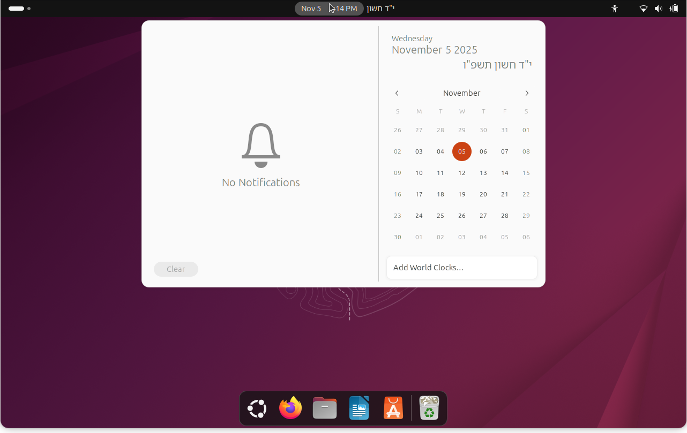

# ZmanBar

ZmanBar is a GNOME Shell extension that adds the Hebrew date to the GNOME top panel and calendar menu.



## About this fork

This repository is a fork of the original [Dev-in-the-BM/ZmanBar](https://github.com/Dev-in-the-BM/ZmanBar) project.

The goal of this fork is to keep the extension clean, maintainable, and easy to package while preserving the original functionality.

## Features

- Shows the Hebrew date in the GNOME top panel.
- Shows the full Hebrew date, including the year, in the clock/calendar menu.
- Adds a separate top-panel Zmanim button with daily zmanim for the configured location.
- Updates the displayed Hebrew date after shkiah when a location is configured.
- Provides preferences for selecting a location.
- Uses a bundled GJS-compatible zmanim/date calculation library.

## Installation from source

Clone this fork and copy it into the GNOME Shell extensions directory:

```sh
git clone https://github.com/salameli/ZmanBar-fork.git
mkdir -p ~/.local/share/gnome-shell/extensions
cp -r ZmanBar-fork ~/.local/share/gnome-shell/extensions/ZmanBar@salameli.github.io
```

Then restart GNOME Shell:

- X11: press `Alt` + `F2`, type `r`, and press `Enter`.
- Wayland: log out and log back in.

Finally, enable **ZmanBar** from the Extensions app.

## Development

ZmanBar is written in modern JavaScript for the GJS runtime used by GNOME Shell extensions.

Repository layout:

- `extension.js` — GNOME Shell extension entrypoint; kept at the package root for GNOME Shell.
- `prefs.js` — preferences entrypoint; kept at the package root for GNOME Shell.
- `src/` — internal JavaScript modules used by the entrypoints.
- `schemas/` — GNOME settings schemas; kept at the package root for standard GSettings compilation.
- `assets/` — screenshots and static project assets.
- `docs/` — testing notes and contributor-facing documentation.
- `scripts/` — development and release helper scripts.

Run the basic validation checks before committing or packaging a release:

```sh
./scripts/check.sh
```

Install local hooks if you use `pre-commit`:

```sh
pre-commit install
pre-commit install --hook-type commit-msg
```

Create a GNOME Shell compatible release zip in `dist/`:

```sh
./scripts/package.sh
```

See [docs/TESTING.md](docs/TESTING.md) for the manual smoke-test checklist and release package sanity checks.
See [docs/STRUCTURE.md](docs/STRUCTURE.md) for details about GNOME Shell layout constraints.
See [DEVELOPMENT.md](DEVELOPMENT.md) for architecture and local development details.

## Contributing

Contributions are welcome. Please read [CONTRIBUTING.md](CONTRIBUTING.md) before opening an issue or pull request.

This project follows the [Contributor Covenant Code of Conduct](CODE_OF_CONDUCT.md). Notable changes are tracked in [CHANGELOG.md](CHANGELOG.md).

## Credits

Original project: [Dev-in-the-BM/ZmanBar](https://github.com/Dev-in-the-BM/ZmanBar)

This fork uses its own extension UUID: `ZmanBar@salameli.github.io`.

## License

This project is licensed under the GNU General Public License v3.0 or later. See [LICENSE](LICENSE) for details.
